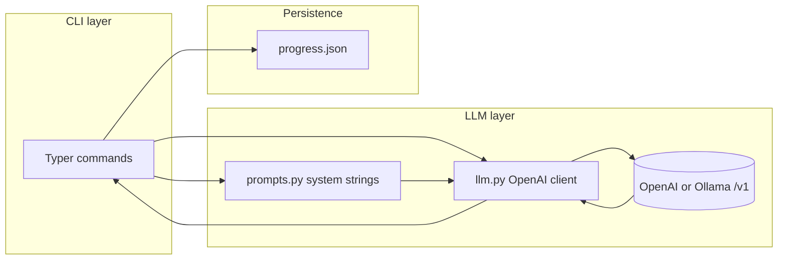

# Developer Study Helper

A **Python CLI** that routes developer-learning tasks to a single **chat-completions** backend (OpenAI API or **Ollama** via OpenAI-compatible `/v1`). Each subcommand picks a **system prompt** (persona + rules), sends the user text, prints **Markdown** in the terminal, and optionally **persists progress** as JSON on disk.

Use this README to explain **what it does**, **how requests flow**, and **why it is structured this way** in interviews.

---

## One-line pitch

> “A small Typer CLI with pluggable LLM backends: mode-specific system prompts, one `chat.completions` call per command, and local JSON for streaks and topic stats—no web server, no database.”

---

## End-to-end flow



**Per request (e.g. `study-helper ask "…"`)**:

1. **Parse** arguments (Typer).
2. **Choose** the system prompt for that mode (`prompts.py`).
3. **Build** the OpenAI client from environment (`llm.py`: API key, optional `OPENAI_BASE_URL`, Ollama detection).
4. **Call** `chat.completions.create` with `system` + `user`, fixed `temperature=0.4`.
5. **Render** the assistant text with Rich `Markdown`.
6. **Optionally write** topic counters / activity dates to `progress.json` (`progress_store.py`).

The **`progress`** command skips steps 3–5 and only reads JSON.

---

## Architecture (how to describe it)

| Layer | Responsibility | Main file |
|--------|----------------|-----------|
| **CLI** | Subcommands, flags, validation (e.g. resume file vs `--text`), exit codes | `cli.py` |
| **Prompting** | One system string per “skill” so behavior stays predictable and testable in principle | `prompts.py` |
| **LLM** | Backend selection: cloud vs local; default model (`gpt-4o-mini` vs `llama3.2`) | `llm.py` |
| **State** | Durable, human-readable progress; no ORM | `progress_store.py` |
| **Voice (optional)** | Offline TTS (`pyttsx3`); mic STT (`SpeechRecognition` + Google Web API) | `voice_io.py` |

**Design choices you can defend in an interview:**

- **Single completion per command (most modes)** — Simple, stateless HTTP; easy to reason about and to swap models. **`mock-interview`** is the exception: it keeps a **message list** and calls `chat.completions` in a loop until the closing scorecard.
- **OpenAI SDK + base URL** — One integration path for OpenAI, Azure-style proxies, **Ollama** (`/v1`), or other compatible servers.
- **System prompts as data** — Modes are “policies,” not separate microservices; changing tone or rules does not change control flow.
- **JSON file in home directory** — Zero setup, easy to inspect and back up; tradeoff: not safe for concurrent writes from many processes (acceptable for a personal CLI).

---

## Progress data model

Default path: `~/.developer-study-helper/progress.json` (override with `STUDY_HELPER_PROGRESS` or `--progress-file`).

Conceptually:

- **`topics`**: map keyed by normalized topic name; tracks `sessions`, `last_touched`, optional `notes` (from recent prompts when `--topic` is used).
- **`interview_sessions` / `resume_reviews`**: counters incremented by those commands.
- **`activity_dates`**: ISO dates when any tracked activity happened; used to compute a **consecutive-day streak** ending today.

---

## Commands ↔ prompts ↔ side effects

| Command | System prompt role | Progress side effects |
|---------|-------------------|------------------------|
| `ask` | Mentor-style Q&A | Optional `record_topic` if `--topic` |
| `code` | Code generation | Optional `record_topic` |
| `error` | Debug / explain failures | Optional `record_topic` |
| `interview` | Question + rubric hints | `record_interview_session` + `record_topic` |
| `mock-interview` | Live back-and-forth mock; closing line `MOCK_INTERVIEW_COMPLETE` | `record_interview_session` + `record_topic` |
| `resume` | Structured resume review | `record_resume_review` |
| `progress` | (none) | Read-only |

---

## Setup

**Requirements:** Python 3.11+

```bash
cd ai-agent
python -m venv .venv
.venv\Scripts\activate
pip install -e .
```

### Ollama (local)

1. Install [Ollama](https://ollama.com) and run: `ollama pull llama3.2` (or another model).
2. **Command Prompt:** `set STUDY_HELPER_OLLAMA=1`  
   **PowerShell:** `$env:STUDY_HELPER_OLLAMA = "1"`  
   Optional: `STUDY_HELPER_MODEL`, `OLLAMA_HOST`.

No `OPENAI_API_KEY` is required when using Ollama mode or `OPENAI_BASE_URL` pointing at Ollama (`…:11434/v1`).

### Mock interview and voice (optional)

**Text-only mock** (uses the same LLM env as other commands):

```bash
study-helper mock-interview "mid-level Python backend" --rounds 4
```

**Voice** (text-to-speech for the interviewer, speech-to-text for your answers):

```bash
pip install -e ".[voice]"
study-helper mock-interview "React + TypeScript frontend" -r 3 --voice
```

Or use `--speak` / `--listen` separately. **TTS** uses SAPI on Windows via `pyttsx3` (offline). **STT** uses `SpeechRecognition` with **Google Web Speech API** (needs network) and **PyAudio** for the microphone. If `pip install PyAudio` fails on Windows, use a [prebuilt wheel](https://www.lfd.uci.edu/~gohlke/pythonlibs/#pyaudio) or install from a conda environment.

**If speech is not recognized:** stay quiet during the first ~1s (noise calibration), then speak clearly. Set Windows **default microphone** to the device you use. The code **retries up to 3 times** before asking you to type. Optional env (PowerShell: `$env:VAR = "1"`): `STUDY_HELPER_MIC_SENSITIVE=1`, `STUDY_HELPER_MIC_SKIP_NOISE_ADJUST=1`, `STUDY_HELPER_SPEECH_LANG=en-IN` (or `en-GB`, etc.), or `STUDY_HELPER_MIC_ENERGY=300` to tune sensitivity.

### Cloud (OpenAI or compatible)

Set `OPENAI_API_KEY`. Optional: `OPENAI_BASE_URL`, `STUDY_HELPER_MODEL`.

See `.env.example` for all variables.

---

## Usage examples

```bash
study-helper ask "What is a closure in JavaScript?"
study-helper code "FastAPI health JSON endpoint" --topic fastapi
study-helper error "Traceback ..."
study-helper interview "mid-level TypeScript full stack" -n 8
study-helper mock-interview "data engineering SQL" --rounds 5
study-helper mock-interview "mobile Kotlin" -r 3 --voice
study-helper resume path\to\resume.md
study-helper progress
```

---

## Repository layout

```
src/study_helper/
  __init__.py
  __main__.py          # python -m study_helper
  cli.py               # Typer app, Rich output
  prompts.py           # SYSTEM_* strings per mode
  llm.py               # Client + Ollama/cloud model defaults; chat() for multi-turn
  voice_io.py          # Optional TTS/STT ([voice] extra)
  progress_store.py    # Pydantic models + JSON load/save
pyproject.toml         # package + study-helper console script
```

Entry point: **`study-helper`** (console script) or **`python -m study_helper`**.

---

## Possible interview follow-ups

- **“How would you add memory?”** — Persist chat turns (SQLite or JSON lines), pass last *N* messages into `messages`, or use a small RAG layer over notes.
- **“How would you scale this?”** — For a personal tool, current shape is fine; for product, add auth, server, rate limits, async jobs, and a real DB with migrations.
- **“How do you test?”** — Mock `chat.completions` in `llm.py`; golden-file tests for `progress_store` load/save and streak logic; CLI smoke tests with Typer’s runner.

---

## License / stack

Stack: **Typer**, **Rich**, **OpenAI Python SDK**, **Pydantic**.  
Treat this project as a learning/portfolio CLI unless you add an explicit license file.
